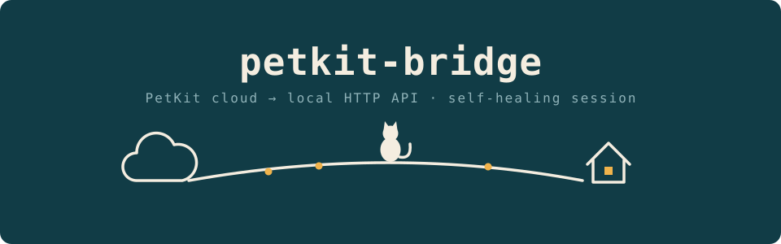

<p align="center">
  
</p>

# petkit-bridge

Local HTTP bridge for **PetKit** devices (feeders, litter boxes, fountains), designed for integration with Homebridge (generic HTTP plugins) and go2rtc (video via WHEP). It relies on the unofficial [pypetkitapi](https://github.com/Jezza34000/py-petkit-api) library to talk to the PetKit cloud and exposes a small token-protected local API.

**Unofficial** project, not affiliated with PetKit. Use at your own risk.

## Why

Generic Homebridge plugins (HTTP switch/sensor) cannot talk to the PetKit cloud. This bridge acts as a translator: on one side it maintains the PetKit cloud session, on the other it exposes simple, stable HTTP endpoints on the local network.

The bridge is designed to be **resilient to cloud session expiry**: the PetKit session expires periodically and, without countermeasures, the service stops responding until you restart the container. Here instead:

- the background refresh detects the expired session and logs back in on its own, rebuilding the client and HTTP connection from scratch (equivalent to an internal restart);
- incoming HTTP requests that hit an expired session also trigger an on-the-fly re-login instead of failing;
- exponential backoff on generic network failures, to avoid hammering the cloud while it is unreachable;
- `/healthz?strict=1` responds 503 when the session is not valid, so a Docker healthcheck can restart the container as a last-resort safety net;
- startup does not crash if the first login fails (e.g. network not ready yet at boot): it starts in a degraded state and keeps retrying.

## Requirements

- A PetKit account **dedicated** to the bridge, different from the one used in the phone app. PetKit allows a single active session per account: if you share the account, every time you open the app the bridge gets logged out (and vice versa). Create a second account and share your devices with it from the main app.
- Docker with the compose plugin (recommended), or Python 3.11+ for direct execution.

## Quick start

```bash
git clone https://github.com/raulhartzen/petkit-bridge
cd petkit-bridge
cp .env.example .env        # fill in credentials and token
cp docker-compose.example.yml docker-compose.yml
docker compose up -d --build
docker compose logs -f petkit-bridge
```

On a successful start you will see the login to the PetKit server and the discovery of your devices. Configuration happens exclusively via environment variables, documented one by one in [`.env.example`](.env.example).

## API

All endpoints (except `/healthz`) require the token, passed as an `Authorization: Bearer <token>` header, an `X-Auth-Token` header, or the `?token=` query string (the latter exists for go2rtc WHEP sources, which cannot send custom headers — avoid it elsewhere, since query strings end up in logs).

| Method | Path | Description |
|---|---|---|
| GET | `/healthz` | Bridge status; with `?strict=1` responds 503 if the PetKit session is not valid |
| GET | `/devices` | List of discovered devices |
| GET | `/device/{id}` | Raw JSON dump of the device (useful to discover your model's fields) |
| GET | `/device/{id}/state` | Compact state (mapped for feeder d4h, litter box t4, fountain ctw3; other models: use the raw dump) |
| GET | `/device/{id}/hk-state` | State in the format expected by Homebridge HTTP plugins |
| GET | `/device/{id}/maint-status` | Maintenance status |
| POST | `/device/{id}/feed` | Manual food dispensing |
| POST | `/feed-all` | Dispense on all feeders |
| POST | `/device/{id}/clean` | Start litter box cleaning |
| POST | `/device/{id}/litter` | Litter box commands |
| POST | `/device/{id}/scoop` | Scooping cycle |
| POST | `/device/{id}/fountain` | Fountain commands |
| POST/PATCH/DELETE | `/device/{id}/whep` | WHEP video sessions for go2rtc (SDP offer, trickle ICE, teardown) |

## Homebridge examples

The examples below assume the bridge runs at `http://192.168.1.10:8787` and were written for these devices: a Yumshare Solo feeder (type `d4h`), a Puramax 2 litter box (type `t4`) and an Eversweet Max fountain (type `ctw3`). First call `GET /devices` (with your token) to find your device IDs, then replace `DEVICE_ID` and `YOUR_TOKEN` in the snippets.

The command examples use the popular [homebridge-http-switch](https://github.com/Supereg/homebridge-http-switch) plugin. Note: plugin config schemas evolve — if a snippet is rejected, check it against the plugin's own README for your installed version.

**Feed button (Yumshare Solo / d4h)** — a stateless switch that dispenses one portion when tapped:

```json
{
  "accessory": "HTTP-SWITCH",
  "name": "Feed Cats",
  "switchType": "stateless",
  "onUrl": {
    "url": "http://192.168.1.10:8787/device/DEVICE_ID/feed",
    "method": "POST",
    "body": "{\"amount\": 1}",
    "headers": {
      "X-Auth-Token": "YOUR_TOKEN",
      "Content-Type": "application/json"
    }
  }
}
```

**Litter cleaning button (Puramax 2 / t4)** — starts a cleaning cycle:

```json
{
  "accessory": "HTTP-SWITCH",
  "name": "Clean Litter Box",
  "switchType": "stateless",
  "onUrl": {
    "url": "http://192.168.1.10:8787/device/DEVICE_ID/clean",
    "method": "POST",
    "body": "{\"mode\": \"CLEANING\"}",
    "headers": {
      "X-Auth-Token": "YOUR_TOKEN",
      "Content-Type": "application/json"
    }
  }
}
```

A single timed scoop cycle (START, wait, END handled by the bridge) is also available via `POST /device/DEVICE_ID/scoop` with an optional body `{"wait": 50}` — same switch pattern as above.

**Maintenance mode switch (Puramax 2 / t4)** — a stateful switch that enters/exits maintenance and reflects the real state via `maint-status` (which returns plain-text `1`/`0`):

```json
{
  "accessory": "HTTP-SWITCH",
  "name": "Litter Maintenance",
  "switchType": "stateful",
  "onUrl": {
    "url": "http://192.168.1.10:8787/device/DEVICE_ID/litter",
    "method": "POST",
    "body": "{\"action\": \"START\", \"mode\": \"MAINTENANCE\"}",
    "headers": {
      "X-Auth-Token": "YOUR_TOKEN",
      "Content-Type": "application/json"
    }
  },
  "offUrl": {
    "url": "http://192.168.1.10:8787/device/DEVICE_ID/litter",
    "method": "POST",
    "body": "{\"action\": \"END\", \"mode\": \"MAINTENANCE\"}",
    "headers": {
      "X-Auth-Token": "YOUR_TOKEN",
      "Content-Type": "application/json"
    }
  },
  "statusUrl": {
    "url": "http://192.168.1.10:8787/device/DEVICE_ID/maint-status",
    "method": "GET",
    "headers": { "X-Auth-Token": "YOUR_TOKEN" }
  }
}
```

The exact action/mode combination to exit maintenance can vary by firmware; the `/litter` endpoint accepts any `DeviceAction` + `LBCommand` pair precisely so you can test combinations in the field (e.g. with `curl`) before wiring them into HomeKit.

**Fountain sensors (Eversweet Max / ctw3)** — `GET /device/DEVICE_ID/hk-state` returns a flat JSON designed for HTTP sensor plugins:

```json
{
  "LeakDetected": 0,
  "BatteryLevel": 87,
  "LowBattery": 0,
  "StatusFault": 0,
  "PowerOn": 1
}
```

Map these fields with any Homebridge plugin that can poll a JSON endpoint (e.g. a leak sensor on `LeakDetected`, a battery service on `BatteryLevel`/`LowBattery`). Fountain commands go through `POST /device/DEVICE_ID/fountain` with a body like `{"action": "MODE_SMART"}` — but read the warning in the code first: fountain control goes through PetKit's BLE relay and may misbehave on some models.

**Camera (Yumshare Solo) via go2rtc** — the WHEP endpoints accept the token as a query string because go2rtc sources cannot send custom headers. In `go2rtc.yaml`:

```yaml
streams:
  yumshare_cam:
    - webrtc:http://192.168.1.10:8787/device/DEVICE_ID/whep?token=YOUR_TOKEN#format=whep
```

This requires the optional WHEP/agora modules to be available to the bridge; without them the endpoint returns 503 and everything else keeps working.

## Security

- Credentials live only in the `.env` file, which is excluded from git. Never put secrets in `bridge.py` or in the compose file.
- Generate a strong `BRIDGE_TOKEN` (`openssl rand -hex 32`).
- The bridge is meant for the local network: do not expose it directly to the Internet.

## Notes

- Device type names (d4h, t4, ctw3, ...) and state fields come from observing real dumps, not from official documentation: different models may require small adjustments in `device_state`.
- If the `pypetkitapi` library changes its exception structure, expired-session detection keeps working via the error-message fallback (already included).
